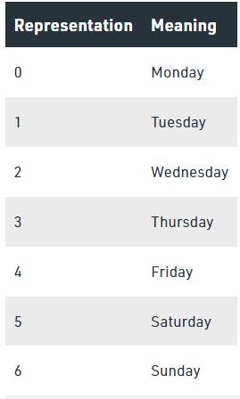
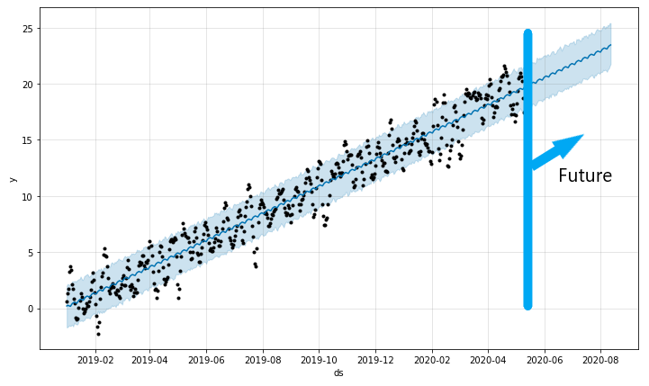

# Module 11 Challenge: Time Series Analysis
UNCC Online FinTech Bootcamp Module 11 Challenge due by 11:59pm 2/20/2022

image from [www.analyticssteps.com](https://www.analyticssteps.com/blogs/introduction-time-series-analysis-time-series-forecasting-machine-learning-methods-models)

---

## Background

With over 200 million users, MercadoLibre is the most popular e-commerce site in Latin America. We've been tasked with analyzing the company's financial and user data in clever ways to make the company grow. So, we want to find out if the ability to predict search traffic can translate into the ability to successfully trade the stock.

---

## What's Being Created

In a bid to drive revenue, we’ll produce a Jupyter notebook that contains our data preparation, analysis, and visualizations for all the time series data that the company needs to understand. We’ll use text and comments to document our findings, and we’ll answer the questions related to our findings. Specifically, this file should contain the following:

 - Visual depictions of seasonality (as measured by Google Search traffic) that are of interest to the company.

 - An evaluation of how the company’s stock price correlates to its Google Search traffic.

 - A Prophet forecast model that can predict hourly user search traffic.

 - A plot of a forecast for the company’s future revenue.

---

## Technologies

This application is written in Python 3.7 using JupyterLab version 3.0.14.

Python libraries used:

 - [Pandas](https://pandas.pydata.org/pandas-docs/stable/) - *an open source, BSD-licensed library providing high-performance, easy-to-use data structures and data analysis tools for the Python programming language.*
 - [Pathlib](https://docs.python.org/3.7/library/pathlib.html) - *a library that enables consistent input and output of files from the main app.*
 - [hvPlot](https://hvplot.holoviz.org/user_guide/Introduction.html) - *a high-level plotting API for the PyData ecosystem built on HoloViews.*
 - [scikit-learn](https://scikit-learn.org/stable/user_guide.html) - *an open source machine learning library that supports supervised and unsupervised learning.*
 - [plotly](https://plotly.com/python/) - *an interactive, open-source, and browser-based graphing library for Python.*
 - [seaborn](https://seaborn.pydata.org/installing.html) - *a visualization library based on matplotlib. It provides a high-level interface for drawing attractive and informative statistical graphics.*
 - [prophet](https://facebook.github.io/prophet/) - *a procedure for forecasting time series data based on an additive model where non-linear trends are fit with yearly, weekly, and daily seasonality, plus holiday effects*

### Installation Guide

prior to running these libraries, install them from the command line:
  - pandas: `conda install pandas` or `pip install pandas`  
  - pathlib: `pip install pathlib`
  - hvPlot: `conda install -c pyviz hvplot` or `pip install hvplot`
  - sklearn: `pip install-U scikit-learn` - included in conda
  - plotly: `pip install plotly==5.5.0`
  - seaborn: `pip install seaborn` or `conda install seaborn`
  - prophet: `pip install prophet`
  
---

## Usage

 1. Visual depictions of seasonality (as measured by Google Search traffic) that are of interest to the company.
 
### Seasonality 1: Day of Week

Our first look at seasonality shows more search traffic occurring earlier in the week (Day 0 = Monday), peaking on Day 1/Tuesday and declining over the rest of the week.

Here's a look at how python datetime translates the numerical day of the week:

image from [Geeks for Geeks](https://www.geeksforgeeks.org/python-datetime-weekday-method-with-example/)

### Seasonality 2: Daily/Hourly traffic

At first glance, it looks like a lot of people shopping in the middle of the night starting around 9pm - 3am, especially Monday-Thursday. However, we must recall that Google Trends data is based on UTC, and most of MercadoLibre's users are in UTC-3:00 (Eastern Brazil and Argentina); and the rest could be in 3 earlier time zones (i.e. UTC-4,5,6, such as Venezuela, Columbia and Mexico). Therefore, the traffic is actually starting around 8/9am local times (12n UTC), peaking 6/7pm local (10pm UTC), and tapering off around midnight locally (4:00am UTC).

#### MercadoLibre Distribution of Revenue by Region, 2019-2020 from [Statista.com](https://www.statista.com/statistics/730392/mercadolibre-revenue-region-share/)

[Reference: World Atlas South America Time Zones](https://www.worldatlas.com/continents/south-america/timezones.html)

### Seasonality 3: Week of Year

We can see a trend up between months 40-52, although the 52nd week has a significant drop, perhaps reflecting that Christmas shopping is over (and, of course, they're spending time with family and not shopping online for a few days).

---

 2. An evaluation of how the company’s stock price correlates to its Google Search traffic.
#### MercadoLibre Stock Closing Price 2015-2020

The correlation between lagged search traffic and stock volatility is -0.12 (weak inverse); and between lagged search traffic and stock price returns is 0.018 (weakly positive).

---

 3. A Prophet forecast model that can predict hourly user search traffic.
   
 According to the original data, looks like around midnight. However, one might be able to argue that if this is UTC time then the actual busiest time of day is more like 7-9pm since Latin America's time zones are around 3-5 hrs behind UTC.
 
 ---

 4. A plot of a forecast for the company’s future revenue.
 #### MercadoLibre Daily Revenues
 
 #### Forecast of Future Revenues
 
 
 **Answer:** Sales forecast for the next quarter:
 - Best case: USD \$2.12 billion;
 - Worst case: USD \$1.77 billion;
 - Most Likely Case: USD \$1.94 billion.

---

## Contributors

Geoff Tarleton - jobeycat@protonmail.com

adapted from Starter Code supplied by UNCC FinTech Online Bootcamp by Trilogy Educational Services, a 2U, Inc. brand.

---

## License

[MIT](LICENSE)